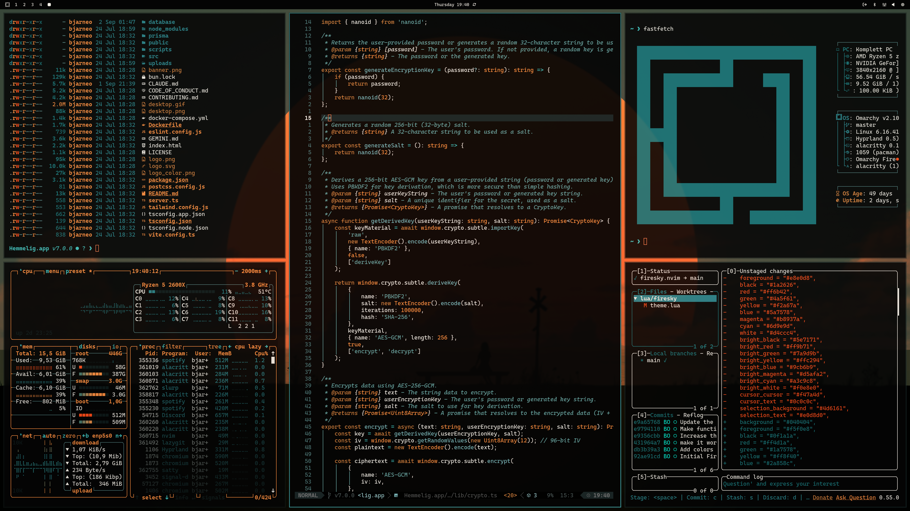

# Pina

Pina is a vibrant, tropical-inspired theme for Omarchy that brings the warm, golden hues of pineapple to your coding environment. It's designed for those who want to infuse their development workflow with energy and brightness, creating a workspace as refreshing as a tropical paradise.

<p align="center">
  
</p>

> In golden light where ideas grow,  
> Sweet syntax flows in amber glow.  
> Each function sharp, like nature's crown,  
> In pina's warmth, no bugs bring down  
> The coding joy that makes minds flow.  

## Screenshot

<p align="center">
  
</p>

## Installation

### Omarchy

To install this theme, simply use the `omarchy-theme-install` command:

```bash
omarchy-theme-install https://github.com/bjarneo/omarchy-pina-theme
```


## Neovim Theme
See the `pina.nvim` folder in this repository for the Neovim theme.

## X.com
[iamdothash](https://x.com/iamdothash)
